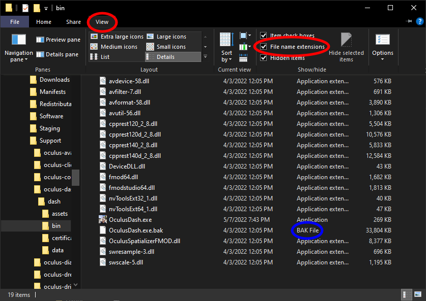
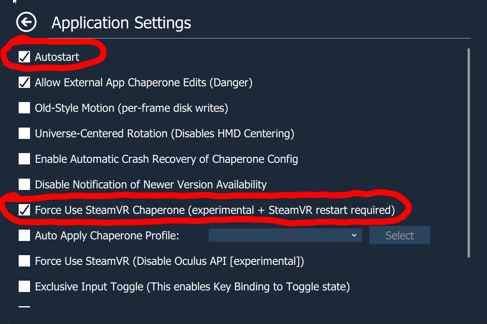

# Oculus Killer
Completely kill the Oculus Dash and auto-launch SteamVR, with my newest discovery.

---
Yep, it's finally a reality. You can now make your Oculus headset into an almost-native SteamVR headset, this simple replacement for Oculus Dash will make it so that as soon as you put your headset on (or launch Link), SteamVR will launch!

Not only does this boost performance by considerable amounts by killing Oculus Dash entirely (seriously, Oculus Dash was eating 200 MB of memory + GPU, even when not in use) so this should help with performance issues with SteamVR on Oculus headsets too. But this also means the Oculus button on your controller does nothing, as there is literally no dash.

There MIGHT be some bugs, if you experience anything you think is a bug, please create a new issue inside this repo.

## Disclaimer
This breaks Oculus based games, as in you might be able to launch Oculus games, but due to the Oculus Dash being quite literally killed you will be forever stuck in that game. It is recommended to use Revive if you need to play the Oculus version of a game, period.

## Installation
- [Download the latest release](https://github.com/LibreQuest/OculusKiller/releases/latest).
- Open Task Manager, go to Services and look for OVRService, right click on it and stop it. (If you have the Oculus app or any VR games open, they WILL close when stopping OVRService.)
- Go to C:\Program Files\Oculus\Support\oculus-dash\dash\bin in Explorer.
- Rename the original OculusDash.exe to OculusDash.exe.bak and move my replacement OculusDash.exe into the folder you just opened in Explorer.
- Go back to Task Manager, look for OVRService again, right click on it and start it.

Enjoy your completely yeeted Oculus Dash with SteamVR auto-start, and the extra performance!

---
# Common fixes
Here is a list of common issues and their respective fixes/workarounds!

## Headset Infinitely Loads (SteamVR doesn't launch)
This issue can occur when you do not have "File name extensions" enabled when renaming OculusDash.exe. To fix this:

- Open "File Explorer"
- Click the "View" tab (at the top)
- Enable "File name extensions"
- Follow the installation instructions

You can verify that you installed it succesfully if "OculusDash.exe.bak" is the "BAK File" type. And looks like the below screenshot.

## OpenXR Games launch, but cannot be seen
This is a very common issue, and has to do with OpenXR prefering the use of Oculus over SteamVR. The fix is very simple:

- Open SteamVR settings (with headset connected)
- Press "Show" under "Advanced Settings"
- Open the "Developer" tab
- Click "Set SteamVR as OpenXR runtine"

Image Source: [Viveport](https://service.viveport.com/hc/en-us/articles/4423262844813-How-to-setup-correct-OpenXR-runtime)

## Non-OpenXR Games launch, but cannot be seen
This is another very common issue, some games manually check for Oculus instead of following your preferences. A workaround can be found by using [OVR Advanced Settings](https://store.steampowered.com/app/1009850/OVR_Advanced_Settings/).

DISCLAIMER: This workaround may prevent some SteamVR games from launching, make sure to undo this fix if you are having trouble launching games.

- Install [OVR Advanced Settings](https://store.steampowered.com/app/1009850/OVR_Advanced_Settings/) and launch it.
- Open the new overlay (found next to the desktop button)
- Open the overlay settings (bottom left)
- Turn on "Autostart"
- Turn on "Force Use SteamVR (Disable Oculus API [expiremental])"

